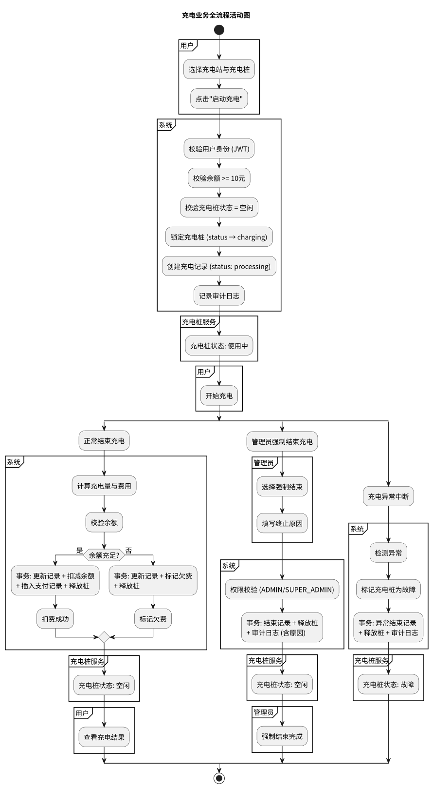
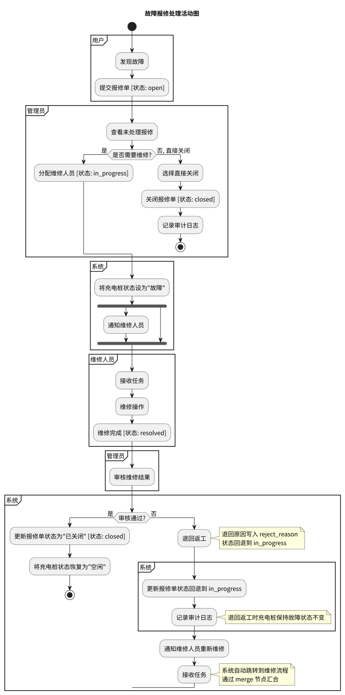

# 活动图

充电业务全流程与故障报修处理流程活动设计。

## 泳道（角色划分）

### 充电业务活动图

活动图包含五条泳道：

| 泳道 | 职责 |
|------|------|
| 用户 | 选择充电桩、启动充电、正常结束充电 |
| 管理员 | 强制结束充电、填写终止原因 |
| 系统 | 校验身份/余额/桩状态、计费扣费、异常处理 |
| 充电桩服务 | 桩状态管理（空闲/使用中/故障） |

### 故障报修活动图

活动图按角色划分为四条泳道：

| 泳道 | 职责 |
|------|------|
| 用户/管理员 | 发现故障、提交报修单 |
| 系统 | 设置桩状态、通知维修人员、恢复桩状态 |
| 管理员 | 查看未处理报修、分配维修人员、审核维修结果 |
| 维修人员 | 接收任务、执行维修、更新报修单状态 |

## 图

### 充电业务全流程

**流程：** 选择充电桩 → 启动充电（校验余额/桩状态/锁定桩）→ 三种结束路径（正常结束扣费 / 管理员强制结束 / 充电异常中断）→ 释放桩。

### 故障报修处理

**流程：** 发现故障 → 提交报修单 → 系统设桩为故障 → 管理员分配 → 维修人员维修 → 管理员审核 → 恢复桩。

## 充电流程说明

1. 用户选择充电站与充电桩，点击"启动充电"
2. 系统校验：用户身份（JWT）、余额（>= 10元）、桩状态（空闲）
3. 系统锁定充电桩（status → charging），创建充电记录（status: processing）
4. 系统进入三种结束分支之一：
   - **正常结束**：用户主动结束 → 计算费用 → 校验余额 → 事务扣费（成功或标记欠费）→ 释放桩
   - **强制结束**：管理员填写原因 → 权限校验 → 事务结束记录 → 释放桩 → 审计日志记录原因
   - **异常中断**：系统检测异常 → 标记桩为故障 → 事务异常结束

## 报修流程说明

1. 用户/管理员发现故障，提交报修单
2. 系统自动将对应充电桩状态设为"故障"
3. 并行执行：管理员查看未处理报修并分配维修人员，系统通知维修人员
4. 维修人员接收任务，执行维修操作
5. 维修完成，更新报修单状态为"已处理"
6. 系统将充电桩状态恢复为"空闲"

## 源文件

- `src/activity_charging.puml` — 充电全流程活动图 PlantUML 源文件
- `src/activity_repair.puml` — 故障报修活动图 PlantUML 源文件

## 相关文档

- [充电流程用例](../usecase/docs/backend/charging-flow.md) — 充电流程场景描述
- [故障报修用例](../usecase/docs/backend/repair.md) — 报修处理场景描述
- [充电桩状态图](../status/README.md) — 充电桩状态流转