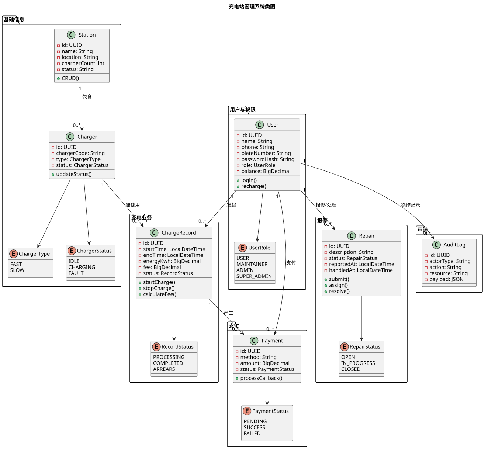

# 类图

充电站管理系统核心类及其关系设计。

## 图

## 核心类

| 类 | 所属包 | 职责 |
|----|--------|------|
| Station | 基础信息 | 充电站信息与 CRUD |
| Charger | 基础信息 | 充电桩信息与状态管理 |
| User | 用户与权限 | 用户信息、认证与余额 |
| ChargeRecord | 充电业务 | 充电记录、计费计算 |
| Payment | 支付 | 支付流水与回调处理 |
| Repair | 报修 | 报修单流转 |
| AuditLog | 审计 | 关键操作审计记录 |

## 核心关系

- Station 1:N Charger（充电站包含充电桩）
- User 1:N ChargeRecord（用户发起充电）
- Charger 1:N ChargeRecord（充电桩被使用）
- ChargeRecord 1:0..1 Payment（充电产生支付）
- User 1:N Repair（用户报修/处理）
- User 1:N AuditLog（用户操作记录）

## 源文件

- `src/class_diagram.puml` — PlantUML 源文件

## 相关文档

- [用例总览](../usecase/docs/overview/usecases.md) — 用例定义与参与者
- [数据库设计](../usecase/docs/database/db.md) — 表结构对应类属性