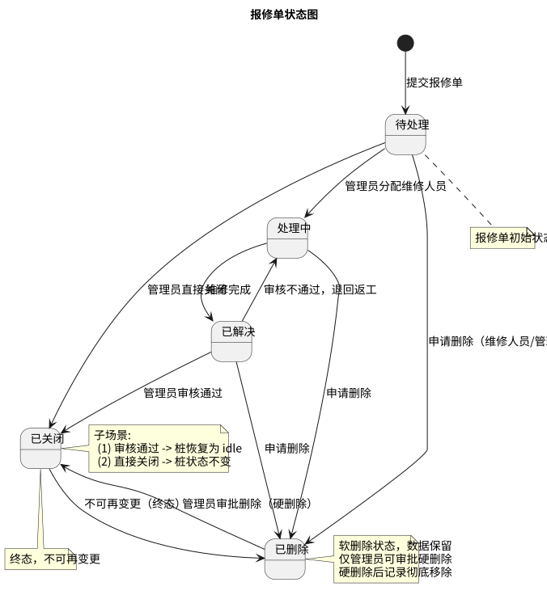
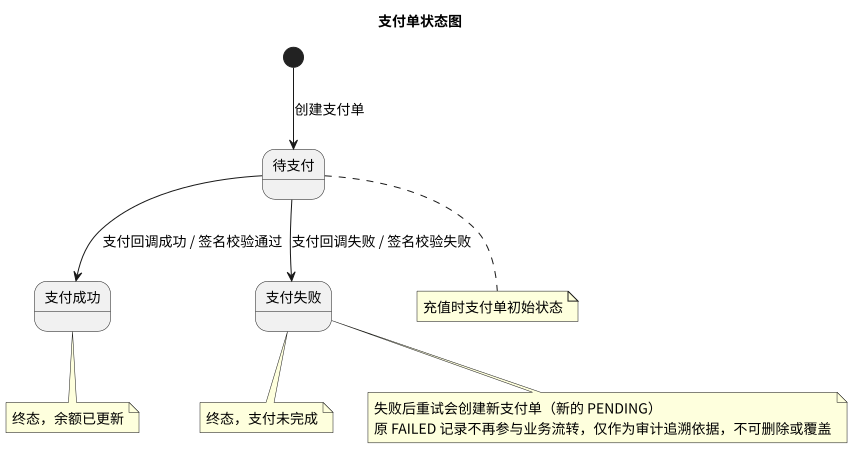

# 状态图

充电桩状态、报修单状态、支付单状态流转设计。

## 图

### 充电桩状态图

充电桩物理状态：空闲（IDLE）→ 使用中（CHARGING）→ 故障（FAULT）→ 空闲（IDLE）。

### 报修单状态图

报修单处理状态：待处理（OPEN）→ 处理中（IN_PROGRESS）→ 已解决（RESOLVED）→ 已关闭（CLOSED），支持退回返工。

### 支付单状态图

支付单处理状态：待支付（PENDING）→ 已审批（APPROVED）→ 支付成功（SUCCESS）/ 支付失败（FAILED）。管理员可直接拒绝将 PENDING 转为 FAILED。

## 状态说明

### 充电桩

| 状态 | 说明 |
|------|------|
| 空闲（IDLE） | 桩可用，等待用户启动充电 |
| 使用中（CHARGING） | 正在充电，不可用 |
| 故障（FAULT） | 需维修处理，不可用 |

> 充电桩另维护 **在线状态**（onlineStatus）：ONLINE / OFFLINE。在线状态独立于物理状态，通过遥测心跳维护（>60秒无心跳标记离线）。离线充电桩不允许启动充电，正在充电的桩断连超过60秒强制停止。

### 报修单

| 状态 | 说明 |
|------|------|
| 待处理（OPEN） | 报修单已创建，待分配 |
| 处理中（IN_PROGRESS） | 已分配维修人员，正在维修 |
| 已解决（RESOLVED） | 维修完成，待管理员审核 |
| 已关闭（CLOSED） | 审核通过或管理员直接关闭，终态 |
| 已删除（DELETED） | 软删除状态，数据保留，待管理员审批硬删除 |

### 支付单

| 状态 | 说明 |
|------|------|
| 待支付（PENDING） | 支付单已创建，等待管理员审批 |
| 已审批（APPROVED） | 管理员审批通过，等待支付网关回调 |
| 支付成功（SUCCESS） | 回调验证通过，余额已更新，终态 |
| 支付失败（FAILED） | 审批拒绝或回调验证失败，终态 |

## 流转路径

### 充电桩

- 空闲 → 使用中：用户启动充电
- 使用中 → 空闲：正常结束充电并扣费完成
- 空闲 → 故障：提交故障报修
- 故障 → 空闲：报修处理完成
- 使用中 → 故障：充电异常中断
- 使用中 → 空闲：管理员强制结束充电
- 使用中 → 空闲：充电桩断连超过 60 秒（Scheduler 自动停止充电并标记 OFFLINE）
- 使用中 → 空闲：扣费失败（标记欠费，桩恢复空闲）

### 报修单

- 待处理 → 处理中：管理员分配维修人员
- 处理中 → 已解决：维修人员完成维修
- 已解决 → 已关闭：管理员审核通过
- 已解决 → 处理中：审核不通过，退回返工
- 待处理 → 已关闭：管理员直接关闭
- 待处理 → 已删除：申请删除（维修人员/管理员）
- 处理中 → 已删除：申请删除
- 已解决 → 已删除：申请删除
- 已删除 → 已关闭：管理员审批删除（硬删除，记录彻底移除）

### 支付单

- 待支付 → 已审批：管理员审批通过充值请求
- 已审批 → 支付成功：支付网关回调成功，签名校验通过，余额更新
- 已审批 → 支付失败：支付网关回调失败或签名校验不通过
- 待支付 → 支付失败：管理员拒绝充值请求

## 源文件

- `src/state_charger.puml` — 充电桩状态图 PlantUML 源文件
- `src/state_repair.puml` — 报修单状态图 PlantUML 源文件
- `src/state_payment.puml` — 支付单状态图 PlantUML 源文件

## 相关文档

- [充电流程用例](../usecase/docs/backend/charging-flow.md) — 充电流程场景描述
- [故障报修用例](../usecase/docs/backend/repair.md) — 报修处理场景描述