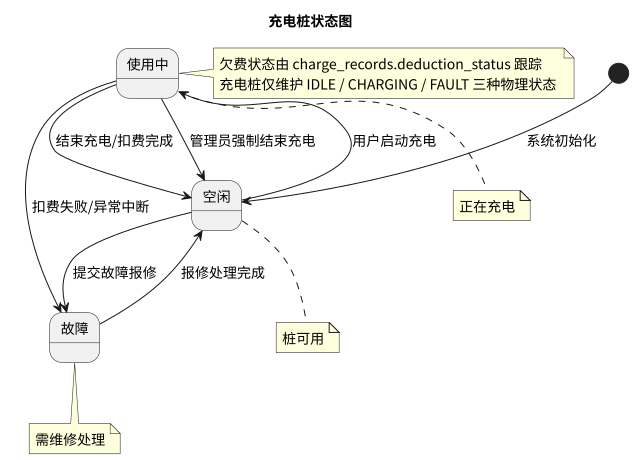

# 状态图

充电桩状态流转设计。

## 图

## 状态说明

| 状态 | 说明 |
|------|------|
| 空闲（IDLE） | 桩可用，等待用户启动充电 |
| 使用中（CHARGING） | 正在充电，不可用 |
| 故障（FAULT） | 需维修处理，不可用 |

## 流转路径

- 空闲 → 使用中：用户启动充电
- 使用中 → 空闲：正常结束充电并扣费完成
- 空闲 → 故障：提交故障报修
- 故障 → 空闲：报修处理完成
- 使用中 → 故障：充电异常中断

## 源文件

- `src/state_charger.puml` — PlantUML 源文件

## 相关文档

- [充电流程用例](../usecase/docs/backend/charging-flow.md) — 充电流程场景描述
- [故障报修用例](../usecase/docs/backend/repair.md) — 报修处理场景描述