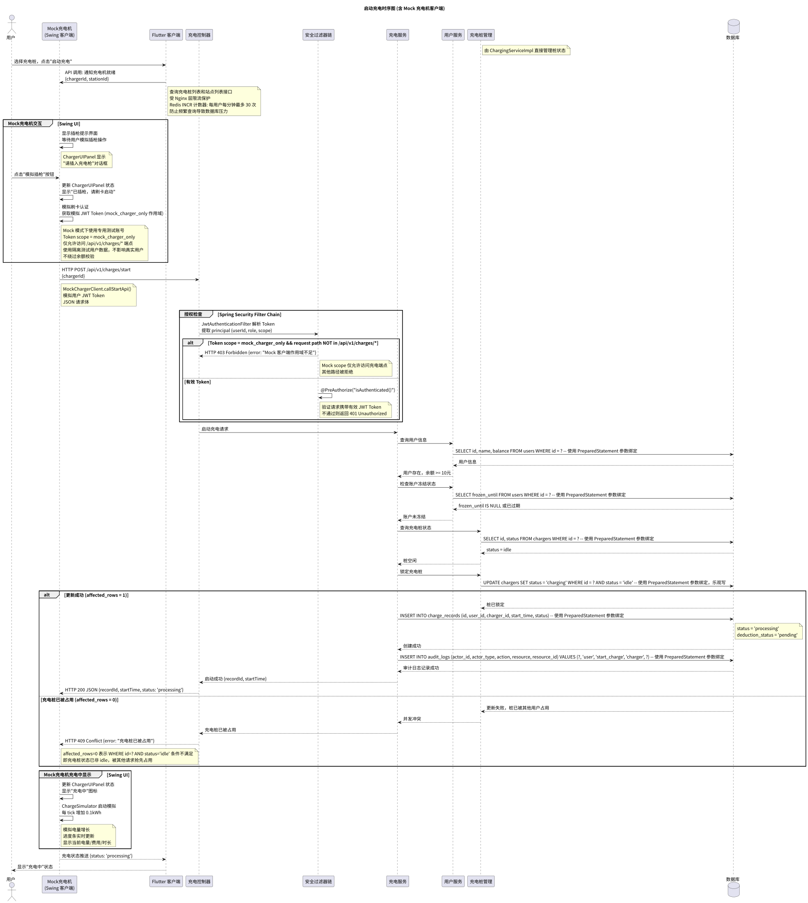
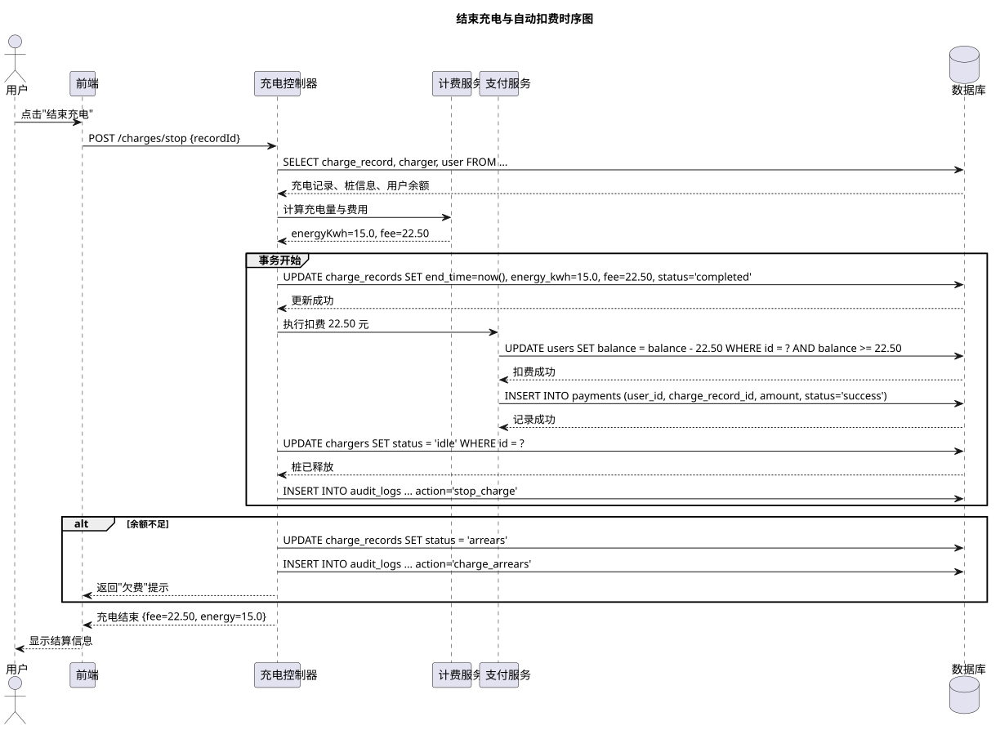
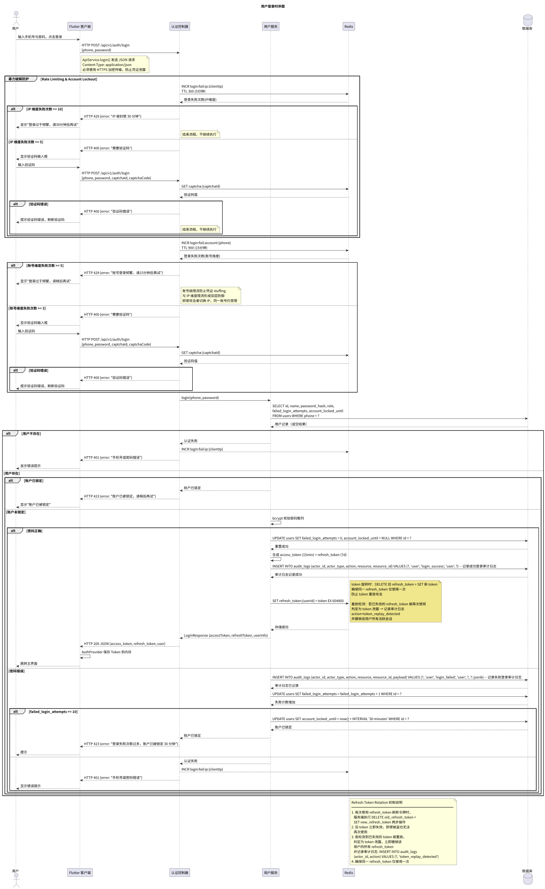
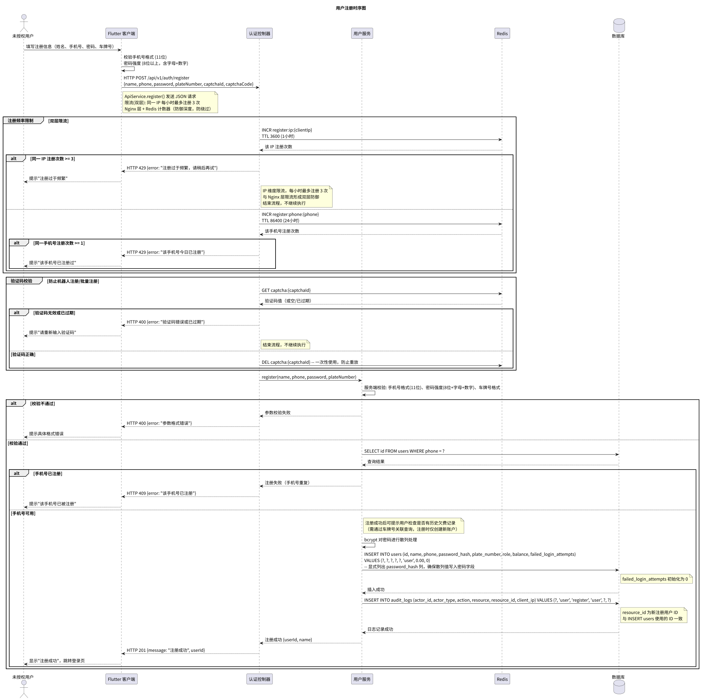
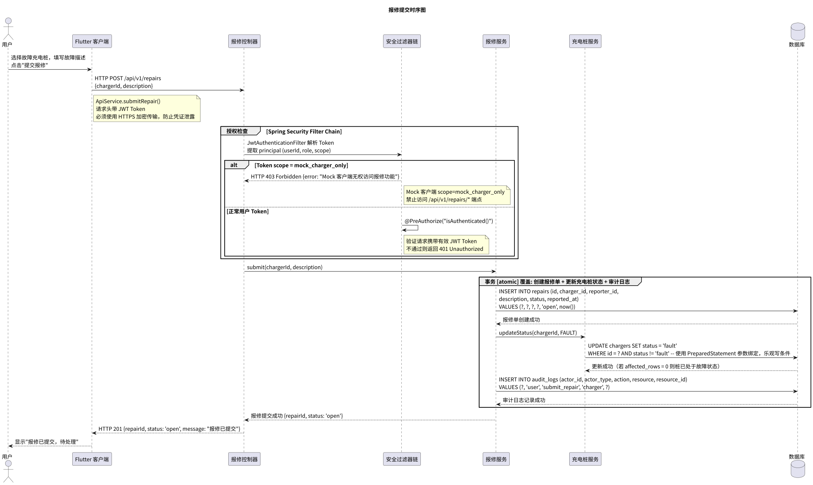
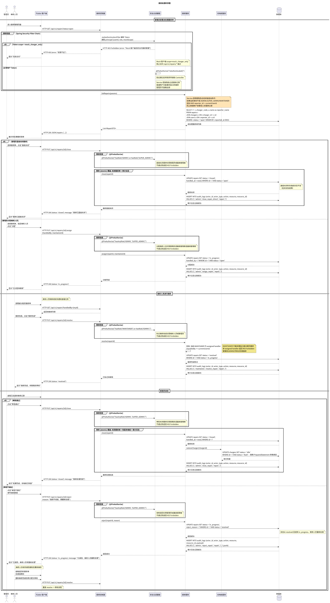
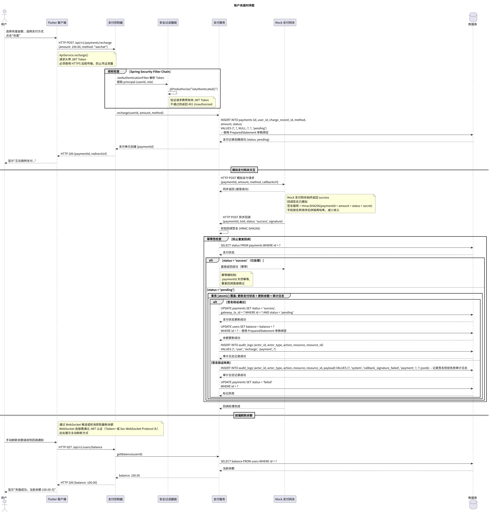

# 时序图

充电业务核心流程的对象交互时序设计。

## 图

### 启动充电

**流程：** 用户选择充电桩 → 校验用户身份与余额（>= 10元）→ 校验桩状态（空闲）→ 乐观锁锁定桩 → 创建充电记录 → 审计日志。

### 结束充电与自动扣费

**流程：** 用户结束充电 → 计算充电量与费用 → 事务内（更新记录 + 扣减余额 + 记录支付 + 释放桩）→ 余额不足则标记欠费。

### 登录

**流程：** 用户输入凭证 → Flutter 调用 REST API → 后端校验密码 → 生成 JWT → Redis 存储 refresh_token → 返回令牌。

### 注册

**流程：** 用户填写注册信息 → 手机号唯一性校验 → 密码强度验证 → bcrypt 加密 → 写入数据库。

### 报修提交

**流程：** 用户选择故障桩 → 创建报修单 → 桩状态更新为故障 → 审计日志。

### 报修处理

**流程：** 管理员查看待处理报修 → 分配维修人员 → 维修人员维修 → 管理员审核通过 → 桩恢复空闲。

### 账户充值

**流程：** 用户选择金额 → 后端创建支付单 → Mock 支付网关回调 → 签名校验 → 更新余额与支付状态。

## 源文件

- `src/sequence_charging.puml` — 启动充电时序图源文件
- `src/sequence_stop_charge.puml` — 结束充电时序图源文件
- `src/sequence_login.puml` — 登录时序图源文件
- `src/sequence_register.puml` — 注册时序图源文件
- `src/sequence_repair_submit.puml` — 报修提交时序图源文件
- `src/sequence_repair_process.puml` — 报修处理时序图源文件
- `src/sequence_recharge.puml` — 充值时序图源文件

## 相关文档

- [充电流程用例](../usecase/docs/backend/charging-flow.md) — 充电流程场景描述
- [数据库设计](../usecase/docs/database/db.md) — charge_records/payments 表结构