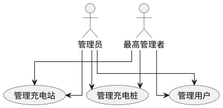
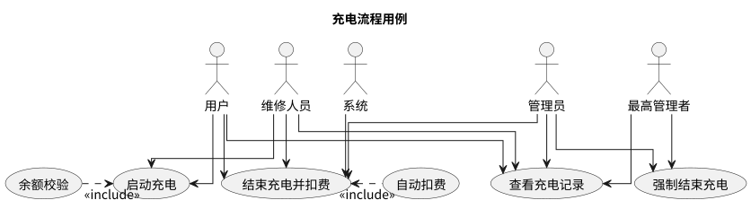
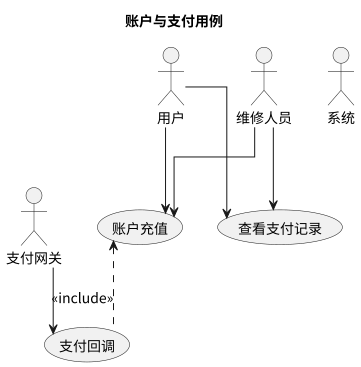
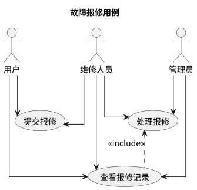

# 后端用例与架构要点（Spring Boot 参考）

本文件汇总后端必须支持的 API 用例、安全要求及交付物。

## 参与者与权限映射

| 参与者 | 权限等级 | 可访问功能 |
|--------|----------|-----------|
| 未授权用户 | 无需认证 | 注册、登录 |
| 用户 | 基础 | 充电、充值、查看自己的记录、提交报修 |
| 维修人员 | 基础+ | 用户全部功能 + 查看和处理报修单（由管理员从用户提升） |
| 管理员 | 中级 | CRUD 充电站/充电桩、管理用户权限、分配和处理报修、部分统计数据 |
| 最高管理者 | 最高 | 全部管理功能、权限变更、全局统计报表 |
| 系统 | 系统级 | 定时任务、自动结算、统计汇总 |

## 必须支持的 API

### 认证与账户
| 方法 | 路径 | 说明 | 权限 |
|------|------|------|------|
| POST | `/api/v1/auth/register` | 用户注册 | 公开 |
| POST | `/api/v1/auth/login` | 用户登录，返回短期凭证 | 公开 |
| POST | `/api/v1/auth/refresh` | Token 刷新 | 已认证 |
| POST | `/api/v1/auth/password-reset` | 密码重置（验证码校验） | 公开 |
| PUT | `/api/v1/auth/password` | 修改密码（旧密码校验） | 已认证 |

### 充电流程
| 方法 | 路径 | 说明 | 权限 |
|------|------|------|------|
| POST | `/api/v1/charges/start` | 启动充电 | 已认证用户 |
| POST | `/api/v1/charges/stop` | 结束充电并结算。`@PreAuthorize("(#record.userId == authentication.principal.id) or hasRole('ADMIN')")` — 仅充电记录所有者和管理员可操作 | 已认证用户/管理员/系统 |
| POST | `/api/v1/charges/{id}/force-stop` | 管理员强制结束指定充电记录，需在请求体中携带强制终止原因，系统将该原因写入 audit_log | 管理员/最高管理者 |
| GET | `/api/v1/charges` | 查询充电记录（分页、过滤） | 已认证用户（仅自己的）/管理员（全部） |

### 充值支付
| 方法 | 路径 | 说明 | 权限 |
|------|------|------|------|
| POST | `/api/v1/payments/create` | 创建充值请求 | 已认证用户 |
| POST | `/api/v1/payments/callback` | 支付网关回调 | 支付网关 |
| GET | `/api/v1/payments` | 查询支付记录 | 已认证用户（仅自己的） |

### 基础信息管理
| 方法 | 路径 | 说明 | 权限 |
|------|------|------|------|
| CRUD | `/api/v1/stations` | 充电站管理 | 管理员/最高管理者 |
| CRUD | `/api/v1/chargers` | 充电桩管理 | 管理员/最高管理者 |

### 用户管理
| 方法 | 路径 | 说明 | 权限 |
|------|------|------|------|
| GET | `/api/v1/users` | 查看用户列表 | 管理员/最高管理者 |
| PUT | `/api/v1/users/{id}/role` | 变更用户角色 | 管理员/最高管理者 |
| PUT | `/api/v1/users/{id}` | 编辑用户信息 | 管理员/最高管理者 |
| DELETE | `/api/v1/users/{id}` | 删除用户 | 管理员/最高管理者 |

### 故障报修
| 方法 | 路径 | 说明 | 权限 |
|------|------|------|------|
| POST | `/api/v1/repairs` | 提交报修单 | 已认证用户/管理员 |
| GET | `/api/v1/repairs` | 查看报修列表 | 已认证用户（仅自己的）/管理员（全部） |
| PUT | `/api/v1/repairs/{id}/assign` | 分配维修人员 | 管理员/最高管理者 |
| PUT | `/api/v1/repairs/{id}/resolve` | 处理完成报修 | 维修人员/管理员 |

### 统计
| 方法 | 路径 | 说明 | 权限 |
|------|------|------|------|
| GET | `/api/v1/analytics/charges` | 充电统计报表（非金额维度：充电次数、充电量等） | 管理员/最高管理者 |
| GET | `/api/v1/analytics/revenue` | 收入统计报表（金额维度：总收入、日均收入等，仅含金额敏感数据） | 最高管理者 |
| GET | `/api/v1/analytics/utilization` | 充电桩使用率：返回空闲/使用中/故障三种状态比例 | 管理员/最高管理者 |
| GET | `/api/v1/analytics/export` | 导出 CSV | 管理员/最高管理者 |

## 关键安全措施

- **认证：** JWT（无状态令牌），access_token 过期时间 15 分钟；refresh_token 存储在 Redis 中并设置 TTL（建议 7 天），用于无感续期。
  - 针对 Swing 桌面端，Token 存储在内存中（应用退出即失效），不使用 Cookie。
  - 每个 Token 包含唯一 jti（JWT ID），服务端维护 jti 黑名单用于令牌吊销，登出时将 access_token 和 refresh_token 加入黑名单。
  - **refresh_token 轮换：** 每次使用 refresh_token 换取新 access_token 时，服务端同时颁发新的 refresh_token 并使旧的 refresh_token 失效（替换 Redis 中的记录），防止 refresh_token 泄露后被重放。
- **密码：** bcrypt/Argon2 加盐散列，密码强度校验（长度、复杂度）。
- **授权：** 基于 RBAC 的接口级权限控制，未授权请求返回 403。
- **输入校验：** 服务端对所有参数进行类型、长度、格式校验，防止 SQL 注入与 XSS。
- **支付安全：** 支付回调签名校验（HMAC / RSA），回调处理幂等，防止重放攻击。建议使用 `payment_gateway_tx_id` 作为幂等键，在 payments 表增加 UNIQUE 约束。
- **审计日志：** 所有关键操作（权限变更、充值、扣费、充电启停、报修处理、强制结束充电）记录日志，包含操作人、时间、资源与操作类型。权限提升/降级操作必须额外记录变更前后的角色值及操作原因。
- **防重放：** Token 设置唯一 jti，服务端维护已作废 Token 黑名单或设置极短有效期。
- **防暴力破解：** 同一 IP 5 分钟内登录失败 5 次触发图形验证码，失败 10 次封禁该 IP 30 分钟。封禁状态记录在 Redis 中，设置 TTL 自动解封。

## 测试与质量保障

- 单元测试，依赖注入的 Mock 测试。
- 集成测试使用 Testcontainers 启动数据库与依赖。
- 安全测试：认证绕过、SQL 注入、XSS、CSRF 等测试用例。

## 交付物

- 可运行镜像、`docker-compose.yml`、OpenAPI 文档、CI workflow 示例。

## 后端模块文档

| 文档 | 内容 | 用例图 |
|------|------|--------|
| `basic-info.md` | 充电站/充电桩/用户管理 |  |
| `charging-flow.md` | 启动/结束充电与结算 |  |
| `account-payment.md` | 注册/登录/充值/支付回调 |  |
| `repair.md` | 报修提交与处理 |  |

## 交叉索引

- [参与者定义与用例总览](../overview/usecases.md) — 参与者角色说明、核心用例、安全要点
- [统计与可视化](../overview/analytics.md) — 统计报表用例
- [数据库设计](../database/db.md) — 包含 `users`、`stations`、`chargers`、`charge_records`、`payments`、`repairs`、`audit_logs` 七张表
- [数据库用例](../database/README.md) — 后端与数据库交互场景
- [前端用例](../frontend/README.md) — 前端界面与交互契约
- [容器化与部署](../containerd/README.md) — Docker/K8s/CI 配置