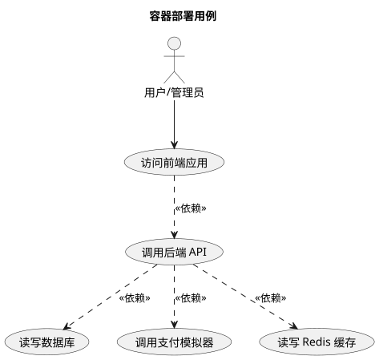
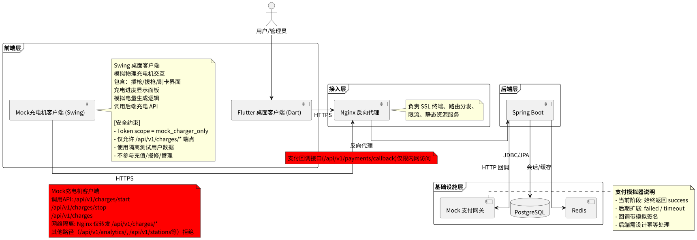

# 容器化与部署

本文件为容器化与持续交付的指导，包含 Dockerfile 要点、本地 Compose 场景、Kubernetes 生产建议与 CI/CD 流程示例。

## 系统架构

| 组件 | 技术栈 | 说明 |
|------|--------|------|
| 前端 | Flutter Desktop (Dart) | 用户端界面（普通用户、管理员、维修人员通过 Flutter 操作）。**Flutter 不是充电桩，Flutter 是用户的操作界面** |
| 模拟充电桩客户端 | Swing 桌面客户端 (Java) | 模拟物理充电机面板交互。**模拟充电桩不是用户端，而是模拟的真实充电桩设备，需要比普通用户更高的权限与 Spring 中间件通讯、获取所有充电桩信息**。使用 Swing 组件（JButton、JComboBox、JLabel 等）提供充电桩选择/插枪/拔枪 UI，选择充电桩后自动生成含充电桩 ID 的二维码供 Flutter 扫码启动充电。支持两种模式：**普通模式**（mock_charger/charger123 登录，JWT scope=user）和**高级模式**（ADVANCED_API_KEY 密钥认证，可见所有充电桩，仅测试环境开放）。后台轮询充电状态（每 30 秒心跳），每 30 秒发送遥测数据（heartbeat）上报在线状态，ChargeSimulator 模拟电量增长（0.1 kWh/秒）。面板内置断网测试/服务器重启/桩离线三个测试场景按钮。**不直接调用充电启停 API（启停由 Flutter 调用后端完成）**。不参与充值、报修、管理等业务流程。满足评分标准 Swing+JDBC 要求 |
| 接入层 | Nginx | SSL 终端、路由分发、限流、静态资源服务 |
| 后端 | Java Spring Boot | REST API 服务，提供业务接口 |
| 数据库 | PostgreSQL | 核心业务数据存储 |
| 缓存 | Redis | 会话管理（refresh_token 存储及 TTL 设置）、数据缓存 |
| 支付 | Mock 支付网关 | 模拟外部支付回调 |

## 容器部署用例图



## 部署架构图



## Docker 要点

- 使用多阶段构建以减小镜像体积。
- 运行时使用非 root 用户。
- 通过环境变量或 Secret 挂载配置。
- 添加健康检查。

## 本地集成（Docker Compose）

- 包含服务：`app`（后端 Spring Boot）、`db`（PostgreSQL）、`redis`（缓存）、`mock-payments`（支付模拟器）。
- 用于本地集成测试与开发。

### Redis 部署说明

Redis 是系统的核心依赖，必须与后端一起部署。docker-compose.yml 中包含以下 Redis 配置：

```yaml
redis:
  image: redis:7-alpine
  ports:
    - "30002:6379"
  volumes:
    - redis-data:/data   # 持久化 refresh_token 和 jti 黑名单
```

- 端口映射：宿主机 `30002` → 容器 `6379`，避免与本地开发环境冲突。
- 持久化：使用命名卷 `redis-data` 保存数据，容器重启后 token 和黑名单不丢失。
- 连接配置：后端通过环境变量 `SPRING_REDIS_HOST=redis`、`SPRING_REDIS_PORT=6379` 连接。

### Redis 安全说明

Redis 在后端安全架构中承担以下关键角色：

- **refresh_token 存储：** 用户登录时生成的 refresh_token 存入 Redis，设置 TTL（建议 7 天），access_token 过期后通过 refresh_token 换取新凭证。
- **令牌黑名单：** 登出时将 access_token 的 jti 加入 Redis，TTL 与 access_token 有效期对齐，确保已作废的令牌无法继续使用。
- **会话管理：** 强制用户下线时（如权限变更），从 Redis 中删除对应用户的 refresh_token。
- **安全配置：** 生产环境 Redis 需设置密码认证，禁用危险命令（FLUSHALL、KEYS 等），绑定内网地址。

### Mock 充电机客户端网络隔离说明

Mock 充电机客户端在部署架构中需遵循以下网络隔离原则：

- **API 路由限制**：Nginx 反向代理配置路由规则，仅将 `/api/v1/charges/*` 路径的请求从 Mock 客户端转发至后端，拒绝所有其他路径请求（如 `/api/v1/stations`、`/api/v1/users`、`/api/v1/analytics` 等）。
- **认证隔离**：Mock 客户端使用专用 `mock_charger_only` 作用域的 JWT Token，该 Token 在 Spring Security Filter Chain 中被限制只能访问充电端点。
- **数据隔离**：Mock 客户端使用独立测试用户账户，操作隔离的模拟数据，不读写真实用户充电记录。
- **禁止绕过**：Mock 客户端所有数据访问必须通过 Controller 层（`ChargingController`），禁止直接调用 Service 或 Mapper 层。

### Mock 支付网关说明

```yaml
# docker-compose.yml 片段
mock-payments:
  image: your-mock-payments:latest
  ports:
    - "8081:8080"
  environment:
    - MOCK_MODE=always_success      # 当前阶段始终成功
    # - MOCK_MODE=random_failure     # 后期可切换到此模式
    # 或按接口粒度控制:
    # - MOCK_PAY_SUCCESS_RATE=1.0   # 成功率，0.0~1.0
```

Mock 支付网关当前阶段实现要点：

- 接收后端发起的支付请求，直接返回模拟回调。
- 回调内容包含模拟签名，后端对该签名做校验（后期接入真实网关时校验逻辑不变）。
- 回调始终返回 `success`，后端需设计幂等处理。
- 预留异常扩展：`failed`（支付失败）、`timeout`（回调超时），在后端回调处理逻辑中做好相应分支注释。
- **注意：Mock 支付网关端口仅限开发环境暴露，生产环境切勿对外暴露支付回调接口。**

### 高级权限（Advanced API Key）部署说明

系统支持三层权限认证，其中高级权限（Advanced）用于测试场景：

| 层级 | 认证方式 | 部署配置 | 说明 |
|------|----------|---------|------|
| 普通权限 | JWT (scope=user) | 默认配置 | USER / MAINTAINER 角色 |
| 管理权限 | JWT (scope=admin) | 默认配置 | ADMIN / SUPER_ADMIN 角色 |
| 高级权限 | ADVANCED_API_KEY | Spring 环境变量 `ADVANCED_API_KEY` | 测试专用，Mock 充电机高级模式使用 |

> **✅ 已实现：** 充电桩遥测/心跳检测（last_heartbeat_at + online_status）已实现。Mock 充电桩每 30 秒发送心跳，Spring 记录遥测时间（last_heartbeat_at），超过 60 秒无遥测自动标记 OFFLINE。

## Kubernetes 生产要点

- 使用 Deployment、Service、Ingress、ConfigMap、Secret。
- 设置 Liveness/Readiness probes 与 HorizontalPodAutoscaler。
- 使用私有镜像仓库与受控的凭证管理（Vault/KMS / Kubernetes Secret CSI）。

## CI/CD 流程

1. lint、静态检查、依赖扫描
2. 构建与单元测试
3. 集成测试（Testcontainers 或测试环境）
4. 构建镜像并推送到仓库
5. 部署到测试环境并运行烟雾测试
6. 按策略发布到生产（灰度/蓝绿）

## 交付清单

- Dockerfile（前端、后端）
- docker-compose.yml（含 mock-payments）
- CI workflow
- Kubernetes manifests / Helm charts

## 交叉索引

- [参与者定义与用例总览](../overview/usecases.md) — 参与者角色说明、核心用例、安全要点
- [后端 API 与权限映射](../backend/README.md) — 后端接口定义、权限控制、安全措施
- [数据库设计](../database/db.md) — 数据库表结构
- [数据库用例](../database/README.md) — 后端与数据库交互场景