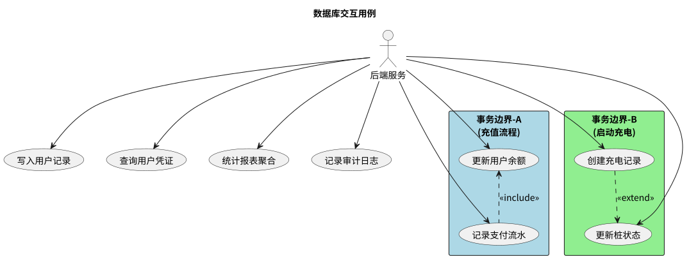
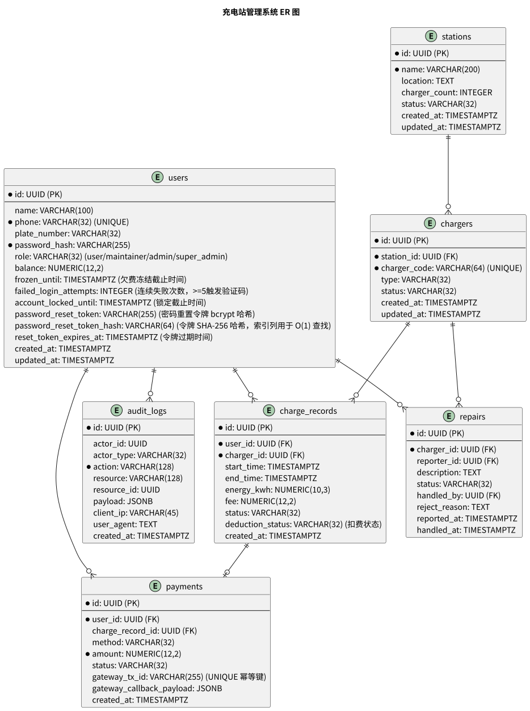

# 数据库设计说明

本系统选用 PostgreSQL 作为核心数据库（可选装 TimescaleDB 扩展用于时序数据分析）。以下列出七张核心表及其字段设计，与功能模块的对应关系见文末映射表。

## 表清单

### 1. users（用户表）

| 字段 | 类型 | 约束 | 说明 |
|------|------|------|------|
| id | UUID | PK | |
| name | VARCHAR(100) | | 用户名称 |
| phone | VARCHAR(32) | NOT NULL, UNIQUE | 登录账号 |
| plate_number | VARCHAR(32) | | 车牌号 |
| password_hash | VARCHAR(255) | NOT NULL | bcrypt/Argon2 散列 |
| role | VARCHAR(32) | NOT NULL DEFAULT 'USER' CHECK (role IN ('USER', 'MAINTAINER', 'ADMIN', 'SUPER_ADMIN')) | USER / MAINTAINER / ADMIN / SUPER_ADMIN |
| balance | NUMERIC(12,2) | DEFAULT 0.00 | 账户余额。UPDATE 时使用 SET balance = balance - ? WHERE id = ? AND balance >= ? 原子扣减 |
| frozen_until | TIMESTAMP | NULLABLE | 欠费冻结截止时间，欠费期间禁止启动充电。NULL 表示未冻结 |
| failed_login_attempts | INTEGER | NOT NULL DEFAULT 0 | 连续登录失败次数，>= 5 触发验证码，>= 10 锁定账户 |
| account_locked_until | TIMESTAMP | NULLABLE | 账户锁定截止时间，锁定期间禁止登录。NULL 表示未锁定 |
| password_reset_token | VARCHAR(255) | NULLABLE | 密码重置令牌，与用户会话绑定，用于 /api/v1/auth/password-reset 端点。存储 bcrypt 哈希值，非明文令牌 |
| password_reset_token_hash | VARCHAR(64) | NULLABLE | 密码重置令牌 SHA-256 哈希，用于 O(1) 查找，对应索引 idx_users_password_reset_token_hash |
| reset_token_expires_at | TIMESTAMP | NULLABLE | 密码重置令牌过期时间，有效期 15 分钟 |
| created_at | TIMESTAMP | DEFAULT now() | |
| updated_at | TIMESTAMP | | |

**对应模块：** 账户与支付、基础信息管理、权限管理

### 2. stations（充电站表）

| 字段 | 类型 | 约束 | 说明 |
|------|------|------|------|
| id | UUID | PK | |
| name | VARCHAR(200) | NOT NULL | |
| location | TEXT | | 地址/位置描述 |
| charger_count | INTEGER | DEFAULT 0 | |
| status | VARCHAR(32) | CHECK (status IN ('NORMAL', 'MAINTENANCE')) | NORMAL / MAINTENANCE |
| created_at | TIMESTAMP | DEFAULT now() | |
| updated_at | TIMESTAMP | | |

**对应模块：** 基础信息管理、统计与可视化

### 3. chargers（充电桩表）

| 字段 | 类型 | 约束 | 说明 |
|------|------|------|------|
| id | UUID | PK | |
| station_id | UUID | FK REFERENCES stations(id) | 所属充电站 |
| charger_code | VARCHAR(64) | NOT NULL, UNIQUE | 充电桩编号 |
| type | VARCHAR(32) | | FAST / SLOW |
| status | VARCHAR(32) | CHECK (status IN ('IDLE', 'CHARGING', 'FAULT')) | IDLE / CHARGING / FAULT |
| created_at | TIMESTAMP | DEFAULT now() | |
| updated_at | TIMESTAMP | | |

**对应模块：** 基础信息管理、充电流程、故障报修、统计与可视化

### 4. charge_records（充电记录表）

| 字段 | 类型 | 约束 | 说明 |
|------|------|------|------|
| id | UUID | PK | |
| user_id | UUID | FK REFERENCES users(id) | |
| charger_id | UUID | FK REFERENCES chargers(id) | |
| start_time | TIMESTAMP | | 充电开始时间 |
| end_time | TIMESTAMP | | 充电结束时间 |
| energy_kwh | NUMERIC(10,3) | | 充电量（千瓦时） |
| fee | NUMERIC(12,2) | | 充电费用 |
| status | VARCHAR(32) | CHECK (status IN ('PROCESSING', 'COMPLETED')) | PROCESSING / COMPLETED，充电过程状态 |
| deduction_status | VARCHAR(32) | NOT NULL DEFAULT 'PENDING' CHECK (deduction_status IN ('PENDING', 'PAID', 'ARREARS')) | PENDING / PAID / ARREARS，扣费状态，独立于充电状态 |
| created_at | TIMESTAMP | DEFAULT now() | |

**对应模块：** 充电流程、账户与支付、统计与可视化

### 5. payments（支付记录表）

| 字段 | 类型 | 约束 | 说明 |
|------|------|------|------|
| id | UUID | PK | |
| user_id | UUID | FK REFERENCES users(id) | |
| charge_record_id | UUID | FK REFERENCES charge_records(id) | NULLABLE，仅扣费时有值 |
| method | VARCHAR(32) | | WECHAT / ALIPAY / CARD / SYSTEM / AUTO_DEDUCT |
| amount | NUMERIC(12,2) | | |
| status | VARCHAR(32) | CHECK (status IN ('PENDING', 'SUCCESS', 'FAILED')) | PENDING / SUCCESS / FAILED |
| gateway_tx_id | VARCHAR(255) | UNIQUE | 支付网关交易流水号，用作幂等键防止重复回调 |
| gateway_callback_payload | JSONB | NULLABLE | 支付网关回调原始数据 |
| created_at | TIMESTAMP | DEFAULT now() | |

**对应模块：** 账户与支付

### 6. repairs（报修单表）

| 字段 | 类型 | 约束 | 说明 |
|------|------|------|------|
| id | UUID | PK | |
| charger_id | UUID | FK REFERENCES chargers(id) | |
| reporter_id | UUID | FK REFERENCES users(id) | NULLABLE，提交人 |
| description | TEXT | | 故障描述 |
| status | VARCHAR(32) | CHECK (status IN ('OPEN', 'IN_PROGRESS', 'RESOLVED', 'CLOSED')) | OPEN / IN_PROGRESS / RESOLVED / CLOSED |
| handled_by | UUID | FK REFERENCES users(id) | NULLABLE，处理人 |
| reject_reason | TEXT | NULLABLE | 审核退回原因，管理员审核不通过时填写 |
| reported_at | TIMESTAMP | DEFAULT now() | |
| handled_at | TIMESTAMP | NULLABLE | |

**对应模块：** 故障报修

### 7. audit_logs（审计日志表）

| 字段 | 类型 | 约束 | 说明 |
|------|------|------|------|
| id | UUID | PK | |
| actor_id | UUID | NULLABLE | 操作人 ID |
| actor_type | VARCHAR(32) | | USER / ADMIN / SYSTEM |
| action | VARCHAR(128) | NOT NULL CHECK (action IN ('START_CHARGE', 'STOP_CHARGE', 'STOP_CHARGE_DEDUCTED', 'FORCE_STOP', 'FORCE_STOP_ARREARS', 'RECHARGE', 'ARREARS_AUTO_DEDUCT', 'DEDUCT', 'SUBMIT_REPAIR', 'ASSIGN_REPAIR', 'RESOLVE_REPAIR', 'CLOSE_REPAIR', 'CLOSE_REPAIR_DIRECT', 'REJECT_REPAIR', 'REGISTER', 'LOGIN', 'LOGIN_SUCCESS', 'LOGIN_FAILED', 'PASSWORD_RESET', 'PASSWORD_RESET_REQUEST', 'PASSWORD_RESET_CONFIRM', 'CHANGE_PASSWORD', 'CHANGE_ROLE', 'UPDATE_USER', 'DELETE_USER', 'CREATE_STATION', 'UPDATE_STATION', 'DELETE_STATION', 'CREATE_CHARGER', 'UPDATE_CHARGER', 'DELETE_CHARGER', 'EXPORT_CSV', 'CHARGE_ARREARS', 'CALLBACK_SIGNATURE_FAILED', 'TOKEN_REPLAY_DETECTED')) | 操作类型 |
| resource | VARCHAR(128) | | 操作资源 |
| resource_id | UUID | NULLABLE | |
| payload | JSONB | NULLABLE | 请求与响应摘要 |
| client_ip | VARCHAR(45) | NULLABLE | 客户端 IP 地址，支持 IPv6 |
| user_agent | TEXT | NULLABLE | 客户端 User-Agent |
| created_at | TIMESTAMP | DEFAULT now() | |

**对应模块：** 全部模块

## 模块与数据表映射

| 功能模块 | 涉及表 | 主要操作 |
|----------|--------|----------|
| 用户注册/登录 | users | 写入用户，校验密码 |
| 基础信息管理 | stations, chargers, users | CRUD |
| 充电流程 | chargers, charge_records, users | 状态变更，记录写入，余额扣减（deduction_status 跟踪扣费结果）|
| 账户充值 | users, payments | 余额更新，支付流水记录 |
| 故障报修 | repairs, chargers | 报修单流转，桩状态变更 |
| 权限管理 | users | 角色字段变更（管理员以上操作） |
| 统计与可视化 | charge_records, payments, stations, chargers | 报表聚合，状态统计 |
| 审计日志 | audit_logs | 关键操作记录 |

## ER 图

## 外键约束

| 表 | 外键 | 引用 | 说明 |
|----|------|------|------|
| chargers | station_id | stations(id) | 充电桩归属充电站 |
| charge_records | user_id | users(id) | 充电记录归属用户 |
| charge_records | charger_id | chargers(id) | 充电记录关联充电桩 |
| payments | user_id | users(id) | 支付记录归属用户 |
| payments | charge_record_id | charge_records(id) | 支付关联充电记录（可为空，仅扣费时有值）|
| repairs | charger_id | chargers(id) | 报修关联充电桩 |
| repairs | reporter_id | users(id) | 报修提交人 |
| repairs | handled_by | users(id) | 报修处理人 |

## 索引设计

| 索引名称 | 表 | 列 | 类型 | 说明 |
|----------|----|----|------|------|
| idx_users_phone | users | phone | UNIQUE | 登录手机号唯一索引 |
| idx_users_role | users | role | BTREE | 角色筛选 |
| idx_chargers_charger_code | chargers | charger_code | UNIQUE | 充电桩编号唯一索引 |
| idx_chargers_station_id | chargers | station_id | BTREE | 按充电站查询充电桩 |
| idx_charge_records_user_start | charge_records | (user_id, start_time) | BTREE | 复合索引，用户充电历史查询 |
| idx_charge_records_charger_time | charge_records | (charger_id, start_time) | BTREE | 充电桩使用记录查询 |
| idx_repairs_status | repairs | status | BTREE | 未处理报修单筛选 |
| idx_payments_user_id | payments | user_id | BTREE | 用户支付记录查询 |
| idx_audit_logs_actor | audit_logs | (actor_id, created_at) | BTREE | 操作审计追溯 |
| idx_charge_records_deduction | charge_records | deduction_status | BTREE | 欠费查询，配合扣费重试与欠费通知 |
| idx_users_password_reset_token_hash | users | password_reset_token_hash | BTREE (partial) | 条件索引，仅非空时有效，密码重置令牌查找 |

## DDL 建表脚本

完整的数据库建表脚本请参考 [database/ddl.sql](ddl.sql)，包含：

- 所有表的 `CREATE TABLE` 语句
- 主键、外键、唯一约束
- 索引创建语句
- 字段注释

## 实施要点

- **幂等：** 支付回调使用 `payment_gateway_tx_id` 作为幂等键，在 payments 表增加 `gateway_tx_id VARCHAR(255) UNIQUE` 约束（复用 `gateway_tx_id`），确保重复回调不产生重复记录。充值请求使用服务端生成的 `UUID` 或 `sequence_number` 作为幂等键，INSERT 前先检查 `UNIQUE` 约束防止重复充值；避免使用客户端提供的时间戳参与哈希，防止可预测性导致重放风险。
- **事务：** 余额更新与账单写入放在同一事务中，保证一致性。充值流程中 INSERT payments 与 UPDATE users.balance 必须在同一事务中执行，使用 `connection.setAutoCommit(false)` + `commit()`/`rollback()`。启动充电时 UPDATE chargers 和 INSERT charge_records 同理。
- **时序数据：** 需要高性能时序分析时，启用 TimescaleDB 扩展，将 `charge_records` 保存在 hypertable 中。
- **数据保留：** 充电记录与支付流水按时间分区或归档。
- **审计完整性：** audit_logs 仅追加写入，禁止修改或删除。

## 欠费场景处理说明

扣费失败时的数据库状态变更规则：

1. **充电记录：** `charge_records.status = 'COMPLETED'`（充电过程已完成），`charge_records.deduction_status = 'ARREARS'`（扣费欠费）。`status` 仅表达充电过程状态，欠费通过 `deduction_status` 独立跟踪。
2. **充电桩：** `chargers.status = 'IDLE'`（桩恢复正常可用状态），欠费不应对桩造成无限期占用。
3. **用户冻结：** `users.frozen_until` 设置为一个合理的截止时间（如扣费失败时刻 + 30 天）。冻结期间用户无法启动新的充电流程。
4. **解冻：** 用户通过充值还清欠费后，系统执行：
   - 更新 `charge_records.deduction_status = 'PAID'`
   - 重置 `users.frozen_until = NULL`
   - 记录支付流水到 `payments` 表

## 交叉索引

- [数据库用例](README.md) — 后端与数据库交互场景（含用例图）
- [参与者定义与用例总览](../overview/usecases.md) — 参与者角色说明、核心用例、安全要点
- [后端 API 与权限映射](../backend/README.md) — 后端接口定义、权限控制、安全措施
- [前端用例](../frontend/README.md) — 前端界面与交互契约
- [容器化与部署](../containerd/README.md) — Docker/K8s/CI 配置