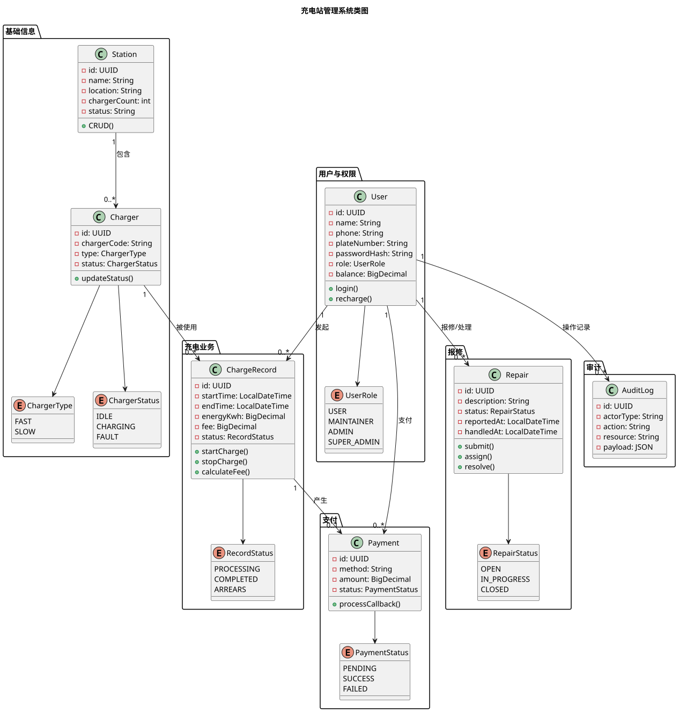
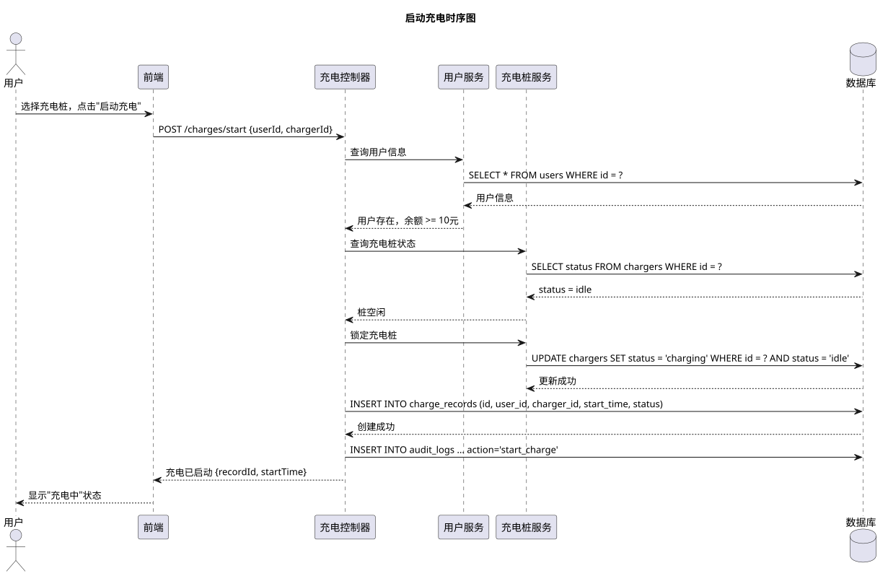
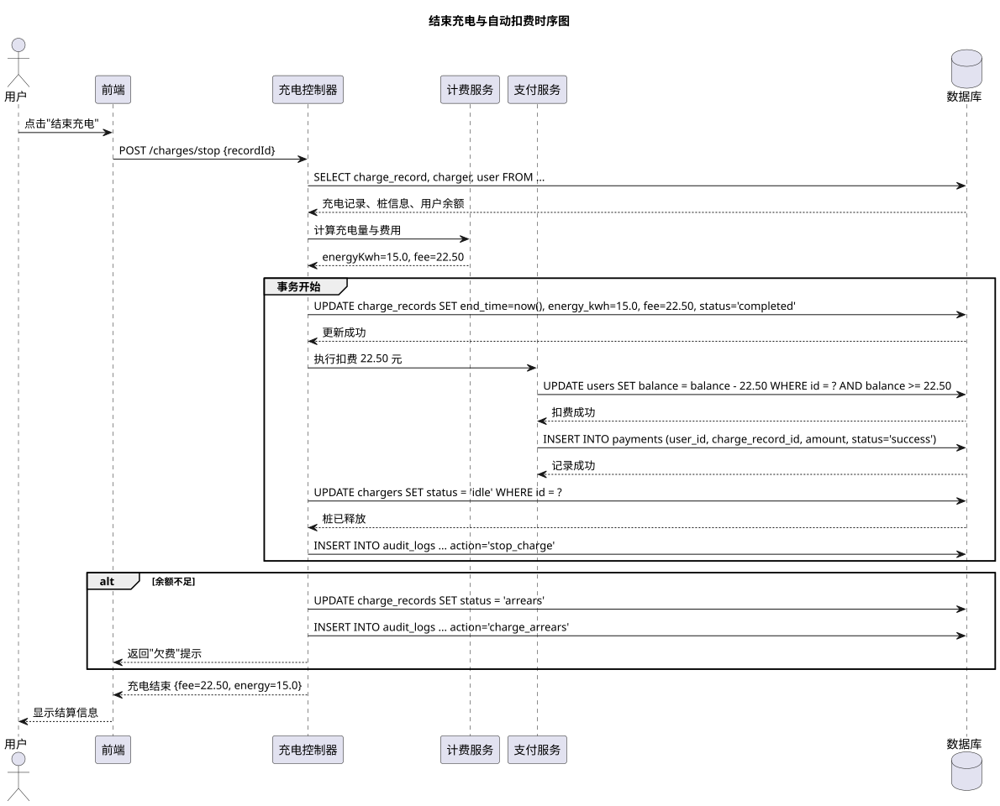
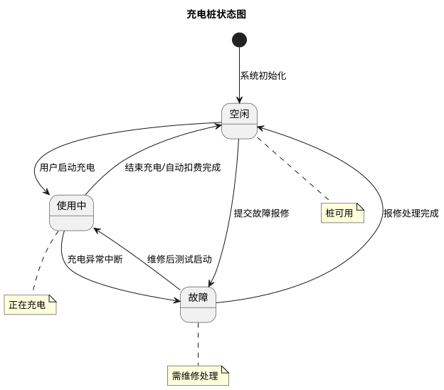
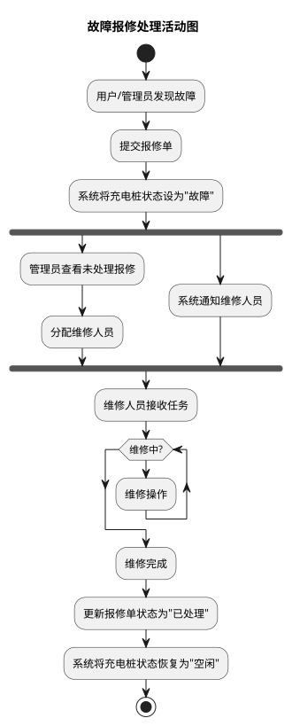

# 设计工件

本文档集中展示充电站管理系统的 UML 设计图，涵盖类图、时序图、状态图和活动图。

## 图清单

| 图类型 | 名称 | 说明 |
|--------|------|------|
| 类图 | [充电站管理系统类图](img/class_diagram.svg) | 系统核心类及其关系 |
| 时序图 | [启动充电](img/sequence_charging.svg) | 启动充电全流程对象交互 |
| 时序图 | [结束充电与自动扣费](img/sequence_stop_charge.svg) | 结束充电、计费、扣费与异常处理 |
| 状态图 | [充电桩状态图](img/state_charger.svg) | 充电桩状态流转（空闲/使用中/故障） |
| 活动图 | [故障报修处理](img/activity_repair.svg) | 报修提交到处理完成的全流程 |

## 类图

**核心类（7个）：**

| 类 | 所属包 | 职责 |
|----|--------|------|
| Station | 基础信息 | 充电站信息与 CRUD |
| Charger | 基础信息 | 充电桩信息与状态管理 |
| User | 用户与权限 | 用户信息、认证与余额 |
| ChargeRecord | 充电业务 | 充电记录、计费计算 |
| Payment | 支付 | 支付流水与回调处理 |
| Repair | 报修 | 报修单流转 |
| AuditLog | 审计 | 关键操作审计记录 |

**核心关系：**
- Station 1:N Charger（充电站包含充电桩）
- User 1:N ChargeRecord（用户发起充电）
- Charger 1:N ChargeRecord（充电桩被使用）
- ChargeRecord 1:0..1 Payment（充电产生支付）
- User 1:N Repair（用户报修/处理）
- User 1:N AuditLog（用户操作记录）

## 时序图

### 启动充电

流程：用户选择充电桩 → 校验用户身份与余额 → 校验桩状态 → 锁定桩 → 创建充电记录 → 审计日志。

### 结束充电与自动扣费

流程：用户结束充电 → 计算费用 → 事务内（更新记录 + 扣费 + 记录支付 + 释放桩）→ 余额不足则标记欠费。

## 状态图

三种状态流转：空闲 → 使用中 → 空闲（正常结束）、空闲 → 故障（报修）→ 空闲（维修完成）。

## 活动图

活动流程：提交报修 → 桩变故障 → 并行（管理员分配 + 通知维修人员）→ 维修 → 完成 → 桩恢复空闲。

## 相关文档

- [参与者与用例总览](../overview/usecases.md) — 用例定义与参与者
- [后端 API 与权限映射](../backend/README.md) — API 定义与权限
- [数据库设计](../database/db.md) — 表结构对应类属性