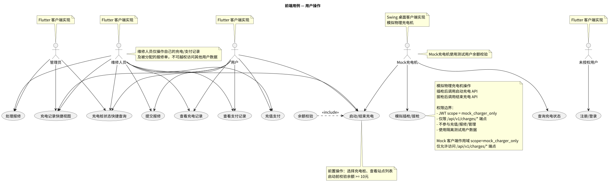
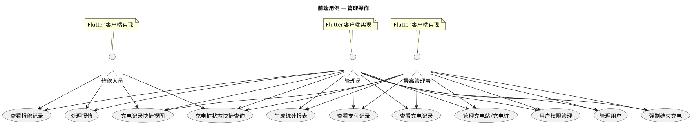

# 前端用例与交互契约

本文件为前端交付级说明，涵盖关键用例、与后端的接口契约要点、安全与测试要求。

## 主要用例

注册/登录、充值、启动充电、结束充电与结算、查看历史记录、提交报修、管理员桩管理、用户权限管理、强制结束充电、生成统计报表。

## 参与者界面

| 角色 | 客户端实现 | 可访问界面 |
|------|-----------|-----------|
| 未授权用户 | Flutter | 注册/登录 |
| 用户 | Flutter | 充电操作、充值、个人记录查看、报修提交 |
| 维修人员 | Flutter | 充电操作、充值、个人记录查看、报修提交与处理 |
| 管理员 | Flutter | 充电站/充电桩管理、用户管理、报修管理、权限管理 |
| 最高管理者 | Flutter | 全部管理界面、统计报表、权限管理 |
| 模拟充电桩（普通模式） | **Swing 桌面客户端** | 模拟充电交互（插枪/拔枪/生成二维码），使用 mock_user/mock123 登录，测试场景模拟。**模拟充电桩不是用户端，而是模拟的真实充电桩设备** |
| 模拟充电桩（高级模式） | **Swing 桌面客户端** | 使用 ADVANCED_API_KEY 密钥认证，可见所有充电桩及中间件交互，UI 显示[高级模式]，仅测试环境开放 |

### 模拟充电桩客户端说明

模拟充电桩客户端是前后端不分离的 Swing 桌面客户端，用于**模拟物理充电机的面板显示与交互**。它不是"用户端"（用户端是 Flutter），而是模拟的真实充电桩设备。支持**两种运行模式**：

#### 普通模式（默认）
- **认证方式**：使用 `mock_user/mock123` 登录，JWT scope=user
- **功能**：模拟物理操作（插枪/拔枪），选择充电桩后自动生成含充电桩 ID 的 QR Code，供 Flutter App 扫码启动充电
- **遥测上报**：每 30 秒发送遥测数据（heartbeat）到 Spring
- **测试场景模拟**：面板内置断网测试、服务器重启、充电桩离线三个测试按钮
- **可见范围**：仅可见自己的测试充电桩

#### 高级模式（测试环境专用）
- **认证方式**：需要 `ADVANCED_API_KEY` 环境变量，使用密钥认证
- **功能**：包含普通模式全部功能 + 可见所有充电桩及与 Spring 中间件交互权限
- **UI 标识**：显示[高级模式]标记
- **限制**：仅测试环境开放

**重要**：两种模式下 Mock 充电机均**不直接调用** `/api/v1/charges/start` 和 `/api/v1/charges/stop` 执行充电启停操作。充电启停由 Flutter App 扫码后调用后端 API 完成。Mock 客户端后台轮询充电状态（每 30 秒心跳，`GET /api/v1/charges`），ChargeSimulator 模拟电量增长（0.1 kWh/秒）。

Mock 客户端 **不参与** 充值、报修、管理等非充电业务流程。

**Mock 客户端安全约束：**
- 使用专用测试用户账户（不会影响真实用户数据）
- **不绕过余额校验**（充电启动前由后端校验余额 >= 10元）
- 面板无管理员操作入口，仅支持充电桩选择与插拔枪

### Flutter 路由权限控制

Flutter 前端已实现集中式权限路由控制：

- **UserRole 枚举**：定义 `USER`、`MAINTAINER`、`ADMIN`、`SUPER_ADMIN` 四个角色，硬编码字符串比较已替换为枚举比较。
- **ProfileScreen 门禁点**：所有受保护页面通过 ProfileScreen 做统一路由守卫，根据当前用户的 `UserRole` 动态加载可访问页面列表，非授权页面不展示入口。
- **角色路由映射**：USER 可访问充电/记录/报修页面；MAINTAINER 额外可访问维修工作台；ADMIN/SUPER_ADMIN 可访问全部管理页面。

> **⚠️ 未实现：** Flutter 端 MAINTAINER 角色专用维修工作台页面尚未提供独立 UI，当前与管理员页面合并。

### Web 版注意事项

- Flutter Web 版本使用 Chrome 渲染，Token 存储于内存（App 刷新后需重新登录）。
- 生产环境建议使用 HttpOnly Cookie 替换内存 Token，防止 XSS 攻击窃取凭证。
- Web 版本不支持 Mock 充电机交互（Mock 客户端为 Swing 桌面版）。

## 与后端契约要点

- 使用 HTTPS，敏感操作由后端处理或加密传输。
- 登录使用短期凭证（内存存储 JWT），Token 过期后刷新。
- 支付流程：前端调用 `POST /api/v1/payments/recharge` 获取支付参数，支付完成后由后端回调并确认。
- 管理界面根据角色权限动态显示/隐藏功能入口。

## 安全与测试要点

- 凭证在 Flutter 客户端存储在内存中（应用退出即失效），严格输入校验与输出转义。
- 前端根据角色隐藏非授权操作（但后端仍做权限校验，前端不可信任）。
- 单元测试与集成测试，在 CI 中执行关键流程测试。

## 用例图

### 用户操作

### 管理操作

## 交付清单

- Flutter 应用包（APK / Windows 安装包 / macOS DMG）
- 接口契约文档（OpenAPI snippet）
- 集成测试脚本与说明

## 未完成项

1. **> ⚠️ 未实现** Flutter 端 MAINTAINER 角色专用维修工作台页面尚未提供独立 UI
2. **> ⚠️ 未实现** 充电桩通讯中间件（ChargerConnector）尚未实现，Flutter 端无法与物理充电机直接交互
3. **> ⚠️ 未实现** 充电桩遥测/心跳检测（last_heartbeat_at + online_status）尚未实现

## 交叉索引

- [参与者定义与用例总览](../overview/usecases.md) — 参与者角色说明、核心用例、安全要点
- [后端 API 与权限映射](../backend/README.md) — 后端接口定义、权限控制、安全措施
- [数据库设计](../database/db.md) — 数据库表结构
- [数据库用例](../database/README.md) — 后端与数据库交互场景
- [容器化与部署](../containerd/README.md) — 容器化与部署用例、架构