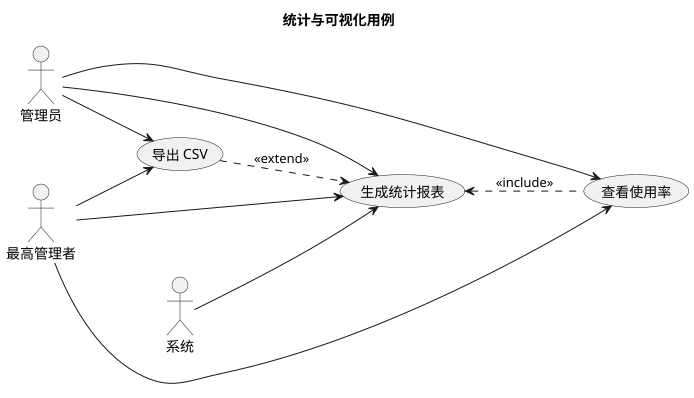

# 统计与可视化用例

**参与者：** 系统、管理员、最高管理者

**前置条件：** 系统中存在至少一笔已完成的充电记录。

## 用户充电统计

1. 管理员或最高管理者进入用户充电统计界面。
2. 系统以柱状图或表格形式展示每位用户的累计充电次数和总充电费用。
3. 数据默认按总费用降序排序。
4. 支持按时间区间筛选。

## 充电站运营分析

1. 管理员或最高管理者进入运营分析界面。
2. 系统展示以下两组数据：
   a. 每个充电站的总充电次数和总收入。
   b. 当前处于"故障"状态的充电桩及其所属充电站（以表格形式高亮显示）。

## 充电桩使用率分析

1. 管理员或最高者进入使用率分析界面。
2. 系统以饼图或柱状图展示所有充电桩中"空闲"、"使用中"、"故障"三种状态的比例。

## 备选场景

- 数据为空：系统显示空状态提示，引导用户录入数据。
- 报表计算超时：系统提示稍后重试，建议在非高峰时段执行。

## 后置条件

- 报表数据在会话中缓存，减少重复查询。
- 支持 CSV 导出供离线分析。

## 非功能性需求

- 报表计算可异步执行以避免阻塞主流程。
- 敏感统计数据（收入汇总）仅限最高管理者访问。

## 用例图

## 相关文档

- [参与者与用例总览](usecases.md) — 参与者角色说明、核心用例、安全要点
- [后端 API 与权限映射](../backend/README.md) — 统计相关接口定义、权限控制
- [数据库设计](../database/db.md) — charge_records/chargers/stations 表结构