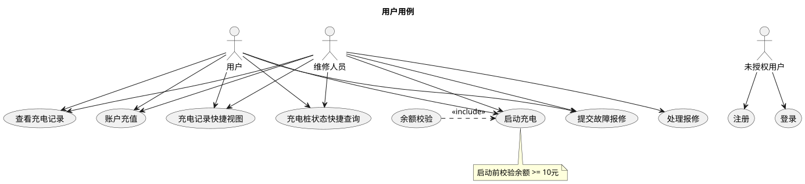
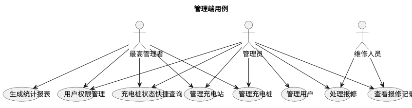
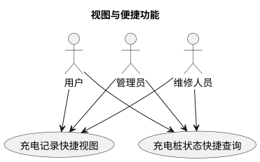
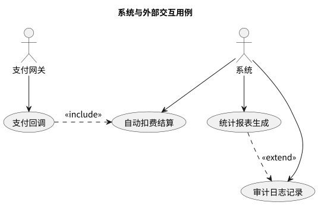

# 用例总览

## 参与者

| 参与者 | 说明 |
|--------|------|
| 未授权用户 | 未登录访客，可注册（选择身份）和登录 |
| 用户 | 电动车车主，注册后获得基础权限，可发起充电、充值、查看个人记录、提交报修 |
| 维修人员 | 由管理员从用户提升获得维修权限，拥有用户全部功能，并可处理报修单 |
| 管理员 | 维护充电站与充电桩信息，管理报修单与用户权限 |
| 最高管理者 | 具有全部管理权限，可提升用户权限、查看全局统计 |
| Mock充电机 | Swing 桌面客户端，模拟物理充电机面板交互（插枪、拔枪），选择充电桩后自动生成含充电桩 ID 的二维码供 Flutter App 扫码启动充电，内置断网/服务器重启/桩离线三种测试场景按钮。**不直接调用充电启停 API**，不轮询同步，不模拟电量增长 |
| 支付网关 | 处理充值与扣费回调（可用模拟器） |
| 系统 | 后台统计、报表导出、定时任务、自动扣费等 |

**权限说明：** 注册获得基础用户权限；权限提升仅由管理员及以上角色操作，可提升用户为维修人员或降级（降级由管理员在后台操作，系统不提供自助降级）。最高管理者拥有系统全部功能访问权。

## 核心用例

- 用户注册 / 登录
- 账户充值（支付）
- 启动充电 / 结束充电并结算
- 查询充电与账单记录
- 故障报修与处理
- 管理充电站/充电桩
- 用户权限管理
- 生成统计报表
- 充电记录快捷视图
- 充电桩状态快捷查询

## 总体用例图

### 用户用例

### 管理端用例

### 视图与便捷功能

### 系统与外部交互用例

## 各模块说明

| 模块 | 路径 | 内容 |
|------|------|------|
| 后端 | [backend/](../backend/README.md) | 基础信息管理、充电流程、账户支付、故障报修 |
| 前端 | [frontend/](../frontend/README.md) | 前端用例与交互契约 |
| 部署 | [containerd/](../containerd/README.md) | 容器化与部署用例、部署架构 |
| 数据库 | [database/](../database/db.md) | 数据库表结构、后端-数据库交互用例 |
| 视图便捷 | [view-features](view-features.md) | 充电记录快捷视图、充电桩状态快捷查询 |
| 类图 | [class](../../../class/README.md) | 系统核心类及其关系 |
| 时序图 | [time](../../../time/README.md) | 启动充电、结束扣费、登录、注册、报修、充值、强制结束充电对象交互 |
| 状态图 | [status](../../../status/README.md) | 充电桩状态流转 |
| 活动图 | [activity](../../../activity/README.md) | 故障报修全流程 |

## 相关文档

- [统计与可视化](analytics.md) — 统计报表与导出用例
- [视图与便捷功能](view-features.md) — 充电记录快捷视图与桩状态快捷查询
- [类图](../../../class/README.md) — 系统核心类设计
- [时序图](../../../time/README.md) — 充电业务流程对象交互
- [状态图](../../../status/README.md) — 充电桩状态流转
- [活动图](../../../activity/README.md) — 故障报修处理流程
- [后端 API 与权限映射](../backend/README.md) — API 定义、权限控制、安全措施
- [前端用例](../frontend/README.md) — 前端界面与交互契约
- [数据库设计](../database/db.md) — 数据库表结构
- [数据库用例](../database/README.md) — 后端与数据库交互场景
- [容器化与部署](../containerd/README.md) — 容器化与部署用例、架构

## 安全要点

- **认证与授权：** 用户注册后获得基础用户权限，管理员及以上角色可对用户权限进行变更。所有管理接口仅限管理员/最高管理者访问。
- **密码安全：** 密码使用 bcrypt/Argon2 加盐散列存储，禁止明文存储与传输。
- **输入校验：** 服务端对所有外部输入进行严格校验，防止注入与异常数据。
- **支付安全：** 不保存敏感支付信息；使用回调签名验证支付结果并设计幂等处理。
- **审计日志：** 关键操作（充值、扣费、报修处理、权限变更）记录审计日志，保存操作人、操作类型、资源与时间戳。
- **会话管理：** 短期凭证（JWT/HttpOnly Cookie），Token 失效机制防重放。