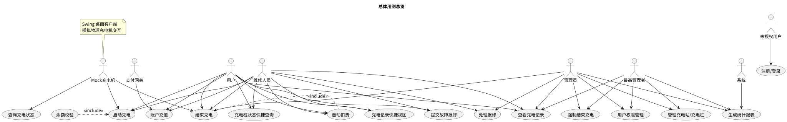

# 用例总览（概览）

本文件提供项目用例的精简概览，说明参与者、核心用例集合与交付物位置。详细前端/后端/容器化要求请参阅对应子目录下的 README。

参与者（精简）：
- 用户（普通用户/车主）
- 管理员（后台管理）
- 运维/维修人员
- 第三方支付网关

核心用例（最小可演示集）：
- 用户注册 / 登录
- 账户充值（支付）
- 启动充电 / 结束充电并结算
- 查询充电与账单记录
- 故障报修与处理
- 管理端桩与用户管理

交付物位置：
- 前端用例与契约：`../frontend/`（前端 README）
- 后端用例与架构：`../backend/`（后端 README）
- 容器化与 CI/CD：`../containerd/`（容器化 README）
- 各模块的 PlantUML 源与渲染图位于各子目录下的 `src/` 与 `img/`（例如：`overview/src/`、`overview/img/`）。

用例图：

安全性与可扩展性要点：

- 认证与授权：实现基本的用户登录验证，管理员受限访问管理功能（角色分离）。
- 输入校验：服务端必须对所有外部输入进行严格校验以防注入与异常数据。
- 支付安全：集成或模拟支付时不在仓库保存敏感支付信息；使用回调签名验证支付结果并设计幂等处理。
- 审计日志：记录关键操作（充值、扣费、报修处理）并保存请求 ID 以便追溯。
- 可扩展接口：采用服务层/DAO 抽象以便后续替换存储或接入外部服务。

以上为交付用的精简说明。
